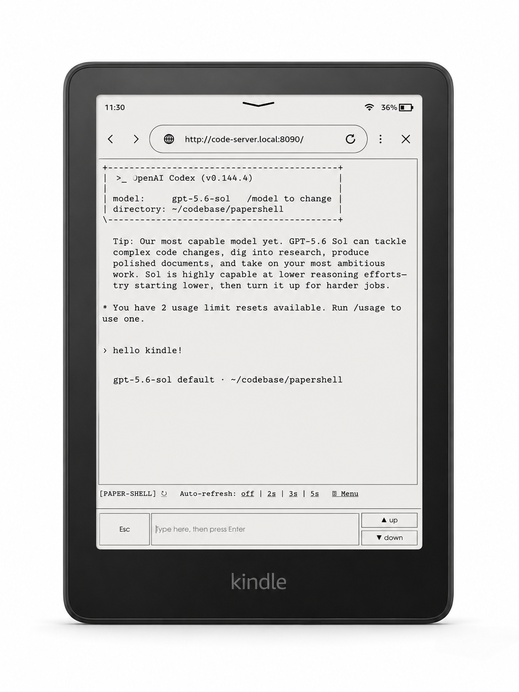

<div align="center">

# 📖 papershell

### Run Claude Code from a $100 Kindle. No app. No JavaScript. Just a browser.

Turn any e-ink reader — or any phone or laptop on your network — into a calm,
distraction-free terminal for **Claude Code**, **Codex**, or any TUI. One small
Python file, the `tmux` you already have, and nothing else.


</div>

---

<div align="center">



</div>

## Why

The Kindle "Experimental Browser" runs an ancient WebKit: flaky JavaScript, no
usable WebSockets, no web fonts, a font that can't draw box-art or emoji. Every
web-terminal (ttyd, Wetty, …) falls over on it.

**papershell flips the problem.** The client stays *dumb* — plain HTML
forms and a `<pre>`, zero JavaScript — and **tmux** does everything hard: the
PTY, the ANSI/TUI rendering, the scrollback. The server just reads the screen as
text and posts your keystrokes.

```
Kindle browser ──plain HTML form──▶  server.py  ──tmux──▶  claude / codex / anything
  (a <pre> + a <form>, no JS)                    capture-pane → plain-text screen
                                                 send-keys    → text + named keys
```

The payoff: a real, usable coding agent on an e-ink screen with **a week of
battery**, no blue light, glare-free in the sun — the nicest place to *read* a
long Claude session there is.

## Features

- 🪶 **Zero dependencies** — one ~600-line Python file, stdlib only, plus `tmux`.
- 🚫 **No JavaScript, no WebSockets** — nothing for an old e-ink browser to choke on.
- 🔡 **Kindle-perfect text** — Claude's logo, boxes and spinners use Unicode the
  Kindle font lacks; the server rewrites them to aligned ASCII, blanks emoji/icon
  "tofu", and pins every CJK glyph to 2 cells so mixed 中/EN tables line up.
- ⌨️ **Thumb-friendly layout** — input + `Esc` on the left, `▲ up / ▼ down`
  stacked on the right, docked to the bottom of the screen. Type, press Enter, done.
- 🔀 **Attach to any session** — drive *any* running tmux session, not just one it
  spawns. `tmux attach` from SSH and you're sharing the same terminal.
- 📐 **Fits the screen, always** — a fixed, tuned column/row size auto-scales to
  the device width. No horizontal scrolling, no scrollbars, ever.
- 📜 **Scroll the transcript** — page up/down through Claude's conversation.
- 🔒 **LAN-first** — optional token gate; never meant to face the public internet.

> **Not just for Kindles.** It works from any phone or laptop browser on your
> network. The Kindle is simply the hardest target — make it work there and it
> works anywhere.

## Quick start

```bash
git clone https://github.com/tiankaixie/papershell.git
cd papershell
./run.sh                     # serves on http://<this-box-ip>:8090/
```

On the Kindle, open **`http://<this-box-ip>:8090/`** and tap **⚙ → Launch claude**.

Override anything with env vars:

```bash
KINDLE_PORT=9000 KINDLE_CMD=codex ./run.sh
```

**Requirements:** a Linux/macOS box running the agent, with **Python 3.8+** and
**tmux**; the agent CLI you want ([`claude`](https://claude.com/claude-code) or
`codex`); and a device on the same LAN or [Tailscale](https://tailscale.com/).
No `pip install`, no `npm install`, nothing to build.

## Using it

**Main page** — one screen, docked to the bottom:

- The `<pre>` box is the live terminal — whatever the agent is showing right now.
- **Type in the field and press Enter** to send your line. (No send button — the
  keyboard's Enter/Go does it.)
- **Esc** cancels/exits TUI prompts; **▲ up / ▼ down** page through the transcript.
- **↻** re-reads the screen; **Auto-refresh 2s/3s/5s** polls while the agent
  works — turn it off before typing.

**⚙ Menu page** — everything else:

- **Switch session** — pick any running tmux session (`▶` = current, `●` = attached elsewhere).
- **Keys**, grouped — **Move** (↑ ↓ ← →), **Edit** (⏎ ⇥ ␣ ⌫), **Ctrl** (^C ^D Home End).
- **Launch** claude / codex / a custom command, and **Kill** the current session.

## Configuration

All via environment variables:

| Variable         | Default   | Meaning                                          |
|------------------|-----------|--------------------------------------------------|
| `KINDLE_PORT`    | `8090`    | HTTP port                                        |
| `KINDLE_HOST`    | `0.0.0.0` | Bind address                                     |
| `KINDLE_CMD`     | `claude`  | Default command to launch                        |
| `KINDLE_COLS`    | `58`      | Terminal width — the view is pinned to this      |
| `KINDLE_ROWS`    | `32`      | Terminal height — the view is pinned to this     |
| `KINDLE_ASCII`   | `1`       | Rewrite Kindle-unfriendly glyphs to ASCII (`0` to disable) |
| `KINDLE_WORKDIR` | `$HOME`   | Directory the agent starts in                    |
| `KINDLE_SESSION` | `kindle`  | Name of the tmux session it spawns               |
| `KINDLE_TOKEN`   | *(empty)* | If set, every request needs `?t=TOKEN`           |
| `KINDLE_SETTLE`  | `0.4`     | Seconds to wait after input before re-capturing  |

## Security

There is **no authentication by default** — it exposes a shell-capable agent, so
keep it on your **LAN or Tailscale only** and never port-forward it to the public
internet. For a light gate, set `KINDLE_TOKEN=...` and open the page once with
`?t=...` (it's kept in a cookie afterwards).

## Run as a service (systemd)

```bash
mkdir -p ~/.config/systemd/user
cp papershell.service ~/.config/systemd/user/
systemctl --user daemon-reload
systemctl --user enable --now papershell
loginctl enable-linger "$USER"   # survive logout/reboot
```

Edit the `Environment=` lines in the unit to change port, command, size, etc.

## How it works

1. On **Launch**, the server starts a detached tmux session running your command.
2. On each page load it runs `tmux capture-pane -p`, rewrites glyphs the Kindle
   can't draw into aligned ASCII, and drops the plain text into a `<pre>`.
3. Typing posts a form; the server runs `tmux send-keys -l "<your text>"` then
   `Enter`. Key buttons send named keys (`Up`, `C-c`, `Escape`, `PageUp`, …).
4. The page's `viewport` width is derived from the fixed column count, so the
   browser zooms the whole page to fit the device — no horizontal scrolling, on
   any screen.

That's the whole trick: **the client stays dumb, tmux stays smart.**

## Troubleshooting

- **Can't reach the page** — make sure the Kindle and the server are on the same
  network, and the port is open: `curl http://localhost:8090/` on the server
  first, then check your firewall (`ufw allow 8090` or equivalent).
- **Blank page / "Session not running"** — no tmux session exists yet. Tap
  **⚙ → Launch claude** (or start one yourself: `tmux new -s kindle`).
- **Text looks garbled or misaligned** — that's what `KINDLE_ASCII=1` (default)
  fixes. If you disabled it, re-enable it. If a specific glyph still renders as
  an empty box, open an issue with the character.
- **Screen is stale** — the page only updates on load. Tap **↻** or turn on
  **Auto-refresh** while the agent is working.
- **Another terminal keeps resizing the session** — the connector pins the
  session to `KINDLE_COLS`×`KINDLE_ROWS` on every view. Attach from SSH with
  `tmux attach -t kindle` and you'll share the same fixed-size screen.

## License

MIT — see [LICENSE](LICENSE).

<div align="center">
<sub>Built for the corner of the couch where the Wi-Fi is good and the light is low.</sub>
</div>
